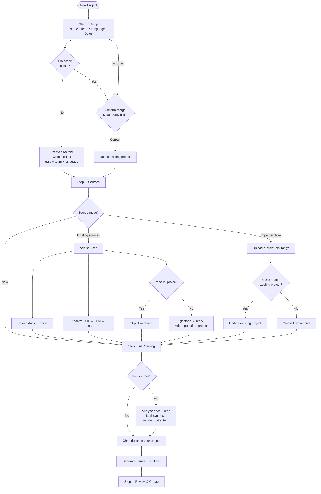
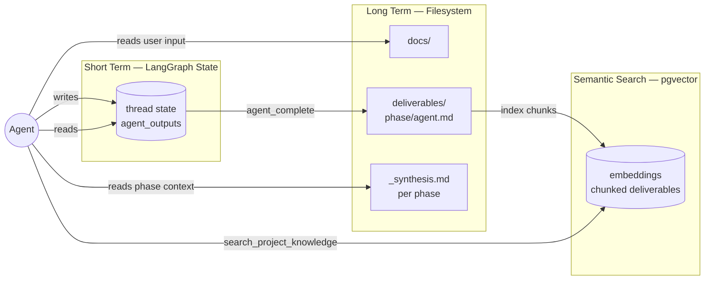
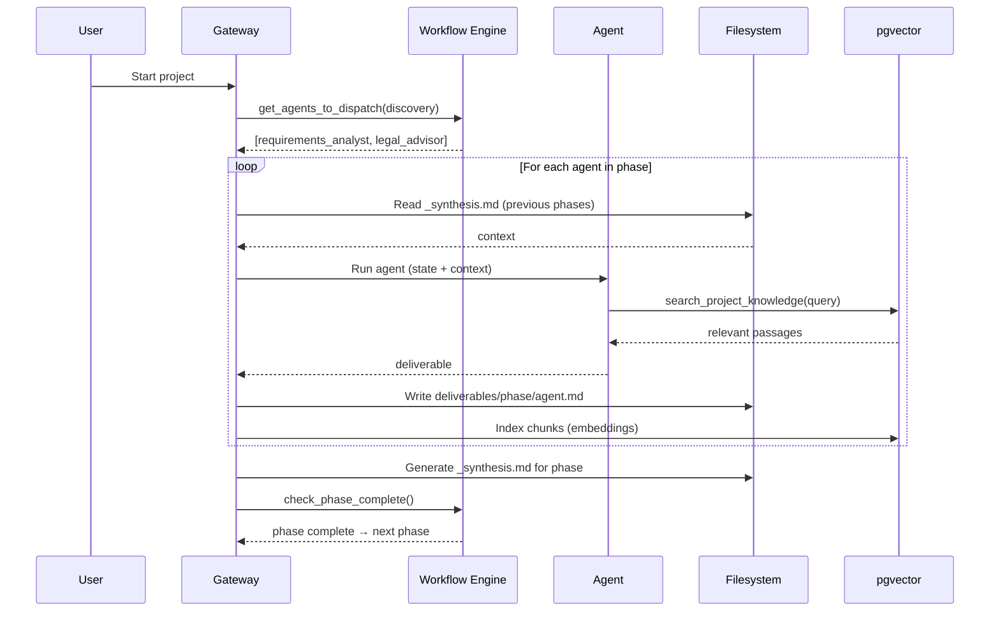

# Project Lifecycle — Data Flow Architecture

## Project Directory Structure

```
/root/ag.flow/projects/<slug>/
├── .project              ← uuid, team, language, repo URLs
├── docs/                 ← User-provided input documents
├── repo/                 ← Cloned Git repository (depth 1)
└── deliverables/         ← AI agent outputs by phase
    ├── discovery/
    │   ├── requirements_analyst.md
    │   ├── legal_advisor.md
    │   └── _synthesis.md
    ├── design/
    │   ├── architect.md
    │   ├── ux_designer.md
    │   ├── planner.md
    │   └── _synthesis.md
    ├── build/
    │   ├── lead_dev.md
    │   ├── qa_engineer.md
    │   └── _synthesis.md
    └── ship/
        ├── devops_engineer.md
        ├── docs_writer.md
        └── _synthesis.md
```

## Onboarding Flow



## Agent Data Flow — Memory Layers



## Phase Execution — Context Chain



## .project File Format

```
uuid: 550e8400-e29b-41d4-a716-446655440000
team: team1
language: fr
repo: https://github.com/org/backend-api
repo: https://github.com/org/mobile-app
```

Each line is a key-value pair. Keys can repeat (`repo` for multiple repositories).
